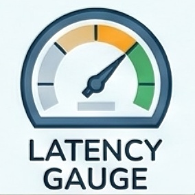
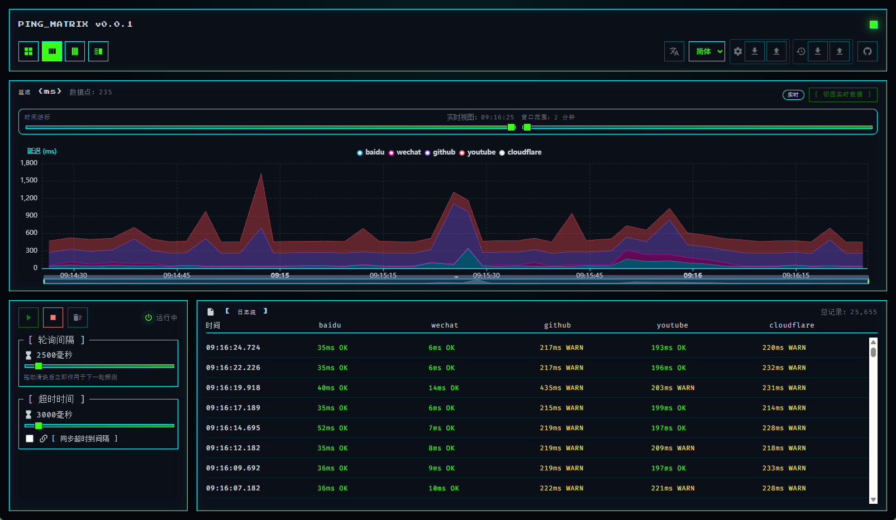

# Ping Matrix

<p align="center">
  
</p>

A retro-style HTTP monitoring matrix dashboard built with Vite + Vue 3 + TypeScript. The app uses `fetch` + `AbortController` (with more stable timers provided by `worker-timers`) to poll multiple sites in parallel, writing success/timeout/error statuses and latency to a persistent log stream, while displaying real-time and historical latency with ECharts stacked line charts.

**Live Demo** · https://ccwq.github.io/http-ping-matrix

### Preview



## Table of Contents
- [Ping Matrix](#ping-matrix)
    - [Preview](#preview)
  - [Table of Contents](#table-of-contents)
  - [Overview](#overview)
  - [Feature Highlights](#feature-highlights)
    - [Monitoring \& Control](#monitoring--control)
    - [Visualization \& Logs](#visualization--logs)
    - [Persistence \& Collaboration](#persistence--collaboration)
    - [Localization \& UX](#localization--ux)
    - [Installability \& Offline](#installability--offline)
  - [Architecture \& Folder Map](#architecture--folder-map)
  - [Getting Started](#getting-started)
    - [Requirements](#requirements)
    - [Install \& Run](#install--run)
  - [Usage Guide](#usage-guide)
  - [Install as Chrome App](#install-as-chrome-app)
  - [Persistence \& Data Portability](#persistence--data-portability)
    - [Export / Import Config](#export--import-config)
    - [Export / Import Logs](#export--import-logs)
  - [Customization](#customization)
    - [Modify Default Targets](#modify-default-targets)
    - [Adjust Log Retention or Export Schema](#adjust-log-retention-or-export-schema)
    - [Update Localization](#update-localization)
  - [Tech Stack](#tech-stack)
  - [Deployment](#deployment)
  - [Troubleshooting \& FAQ](#troubleshooting--faq)

## Overview
Ping Matrix is a single-page dashboard that keeps the control flow, visualization, and logs in sync:

1. `usePingMatrix` manages target sites, timers, logs, and local preferences (interval/timeout/sync rules).
2. `HeaderBar` handles layout switching, language selection, and config/log import/export operations.
3. `LatencyChart` renders real-time/historical curves within a fixed window, allowing timeline dragging or range selection.
4. `LogTable` uses `useVirtualList` for virtual scrolling, maintaining smooth performance even with thousands of records.

## Feature Highlights

### Monitoring & Control
- 🔁 **Worker Timer Driven**：Uses `worker-timers` to reduce missed ticks caused by background tab throttling.
- ⚙️ **Sync/Independent Timeout**：Timeout can be locked to equal the polling interval, or set independently between 0.5s–30s.
- 💾 **IndexedDB Log Persistence**：Retains the last 3 days of data (adjustable via `src/config/logConfig.ts`).

### Visualization & Logs
- 📈 **Multi-layout ECharts Panel**：4 layouts maintain grid arrangement on both desktop and mobile.
- 🧮 **Real-time/Historical Window**：Timeline can switch between "realtime" and any historical point, with range slider to zoom 1–60 minute windows.
- 📜 **Virtual List Logs**：Color-coded labels for success/warn/error/timeout, with error details in tooltips.

### Persistence & Collaboration
- 🔐 **Preference Storage**：Interval, timeout, sync toggle, layout mode, and language selection are all persisted via `useStorage`.
- 📦 **JSON Import/Export**：Provides configuration (timer+layout+language) and log interoperability via JSON import/export.

### Localization & UX
- 🌐 **Trilingual Interface**：Automatically reads saved language from `localStorage` by default, with built-in `en` / `zh-CN` / `zh-TW`.
- 🧩 **Matrix-style UI**：Dark background with bright borders, paired with monospace/pixel fonts and retro buttons, sliders.

### Installability & Offline
- 📲 **Installable PWA**：Manifest + Service Worker allow Chrome to show the install button and remember the app as a standalone window.
- 🚀 **Auto-updating Service Worker**：`vite-plugin-pwa` handles the asset cache and `beforeinstallprompt` UX so users always get the latest build without cache busting chores.

## Architecture & Folder Map

```
src/
├─ components/         # UI components like Header, Controls, Chart, Log Table
├─ composables/        # usePingMatrix centralized business logic
├─ config/             # Adjustable constants like log retention policies
├─ services/           # IndexedDB persistence, config/log import/export
├─ locales/            # i18n resources (en, zh-CN, zh-TW)
├─ assets/ & public/   # Static assets, copied directly during build
├─ main.ts             # App startup + i18n initialization
└─ style.css           # Global pixel-style CSS & layout presets
```

Key interactions maintain a "single source of truth" from top to bottom:
- `usePingMatrix` → unified `start/stop/clear` triggering, `ping()` execution, log writing, and IndexedDB synchronization.
- `HeaderBar` → handles data exchange through `configTransfer` / `logTransfer` with corresponding JSON schemas.
- `LogTable` / `LatencyChart` → only consume `log` and `targets`, completely side-effect free for future reuse.

## Getting Started

### Requirements
- Node.js **20+**
- npm **10+**

### Install & Run
```bash
npm install
npm run dev        # http://localhost:5173
npm run build      # type-check + Vite build outputs to dist/
npm run preview    # Preview dist/ with local server
```

> Tip: The page automatically calls `start()` on first load. Click Stop to observe the idle state.

## Usage Guide
1. **Press `[ START ]`** to begin polling. LED indicators and Header status will update synchronously.
2. **Drag the Interval/Timeout sliders** to adjust frequency; check "Sync" to lock them together.
3. **Select layout & language**：Layout pills and language dropdown in Header save preferences immediately.
4. **Export / Import**：Config / Logs groups in Header handle JSON import/export respectively (see below).
5. **Log panel**：Hover over cells to view error details, header shows total entry count.
6. **Chart panel**：In realtime mode, press "Back to Realtime" to resume auto-scrolling.

## Install as Chrome App
1. Open https://ccwq.github.io/http-ping-matrix/ in Chrome (or the hosted URL you deploy).
2. Interact with the page at least once (Chrome requires a click/tap and ~30 seconds dwell time).
3. Use either of the following:
   - Click the **Install App** pill in the header (shown once the browser fires `beforeinstallprompt`).
   - Or use Chrome's omnibox icon / menu (`⋮ > Install Ping Matrix…`).
4. After installation the dashboard opens in its own window; the header hides the button automatically.

## Persistence & Data Portability

| Type | Location | Description |
| --- | --- | --- |
| Preferences | `localStorage` (`ping-matrix-*`) | Custom intervals/layout/language, auto-loaded when browser restarts. |
| Logs | IndexedDB (`http-ping-logs`) | Retains 3 days of data, expired records cleaned during write/read operations. |
| Config Export | `services/configTransfer.ts` | `type=http-ping-config`, import across devices to maintain consistent behavior. |
| Log Export | `services/logTransfer.ts` | `type=http-ping-logs`, includes retention info and sorted in reverse chronological order. |

### Export / Import Config
1. Click the download button in the Header's gear group → Downloads `ping-config-*.json`.
2. Click the upload button in the target environment → Select JSON → Shows success message if validation passes.

### Export / Import Logs
1. Log export files contain an `entries` array, useful for support/troubleshooting.
2. Import automatically overwrites IndexedDB and immediately refreshes the log list in the interface.

## Customization

### Modify Default Targets
Edit `DEFAULT_TARGETS` in `src/composables/usePingMatrix.ts`:
```ts
const DEFAULT_TARGETS = [
  { id: 'github', name: 'github', url: 'https://github.com/favicon.ico', color: '#8b5cf6' },
  { id: 'new-api', name: 'internal api', url: 'https://api.example.com/ping', color: '#ffd500' }
]
```
- Ensure `id` is unique, use chart-readable HEX for `color`.
- Targets are not exposed in UI forms; consider using a configuration center to generate this list in production environments.

### Adjust Log Retention or Export Schema
- Modify `retentionDays` in `src/config/logConfig.ts`, other services automatically read the millisecond value.
- If modifying import/export fields, synchronously update validation logic in `configTransfer` / `logTransfer`.

### Update Localization
Edit `src/locales/*.json`, add new keys and use them in components via `t('key')`.

## Tech Stack
- **Vue 3 + `<script setup>`**：Drives UI and reactive state.
- **Vite 7**：Blazing fast development experience with `__APP_VERSION__` injection.
- **ECharts 6**：Stacked line charts + dataZoom + custom tooltips.
- **@vueuse/core**：Utilities like `useStorage` and `useVirtualList`.
- **worker-timers**：More accurate `setInterval` execution even in background tabs.
- **IndexedDB + nanoid**：Persistent logs with unique IDs.
- **unplugin-icons**：On-demand Material Design Icons import.

## Deployment
```bash
npm run build        # Build dist/ with type-checking
npm run deploy       # Run scripts/deploy.js to push to GitHub Pages
```
The `deploy` script automatically:
1. Builds the production package;
2. Bumps the patch version in `package.json`;
3. Publishes `dist/` using `gh-pages`;
4. Pushes `master` branch with tags.

> Ensure the demo site has consistent configuration for the new base (`/http-ping-matrix/`) before deployment.

After deployment, visit the hosted URL and run Lighthouse (PWA preset) to ensure all installability checks are green and that `manifest.webmanifest` / `sw.js` are accessible from the published origin.

## Troubleshooting & FAQ
- **CORS/opaque response**：The app only needs to send `no-cors` requests to measure latency. If a target is completely inaccessible, it will show `ERR/Timeout`.
- **Large log size**：Use the `[ CLEAR LOG ]` button in Header or import an empty log file to reset.
- **No data in chart**：Ensure `[START]` has been pressed and `targets` list is not empty; check `ping()` exceptions in devtools.
- **Integration with other projects**：Copy `usePingMatrix`, `LatencyChart`, and `LogTable` to your Vue app, keeping dependencies related to `LOG_RETENTION_MS`.

---

Feel free to share improvements via Issues/PRs, or refer to [AGENTS.md](AGENTS.md) for project collaboration guidelines.
